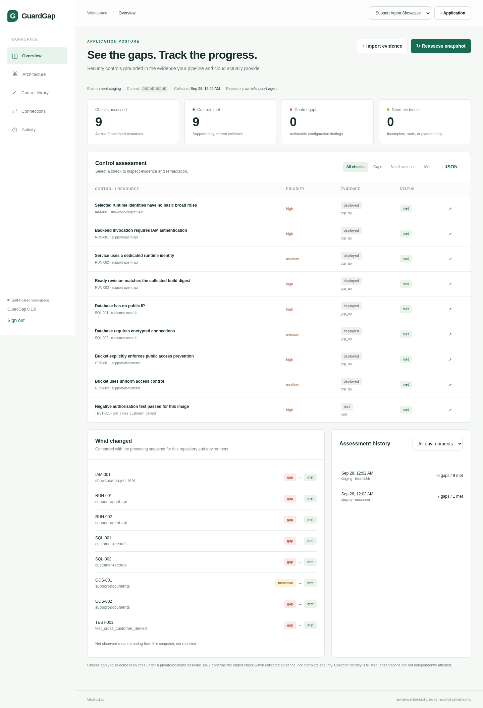
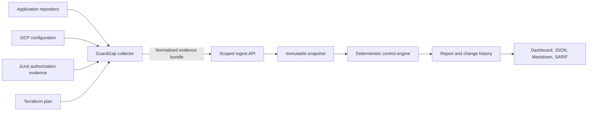

# GuardGap

**Discover what is deployed. Identify control gaps. Recollect evidence after a fix.**

[](LICENSE)
[](pyproject.toml)
[](CHANGELOG.md)
[](https://github.com/mrunlikeliest/GuardGap/actions/workflows/ci.yml)



GuardGap is a self-hosted Python service with a web dashboard, a standalone
collector CLI, a deterministic control engine, and persistent assessment history.
Run the same service on your laptop, a VM, Kubernetes, or a cloud container
platform. The collector runs in CI/CD or on a trusted runner and pushes evidence
to the service. Hosting location does not determine what it can assess.

This is a complete runnable **v0.1 implementation**, not a claim of universal
cloud coverage or production certification. Its first supported integration is
GitHub Actions + GCP (Cloud Run, Cloud SQL, Cloud Storage, and IAM), with Python
source inventory, saved Terraform plan parsing, and named JUnit test evidence.

GuardGap is open source under the [MIT License](LICENSE). Start with the
[showcase report](showcase/SHOWCASE_REPORT.md), run the built-in demo without
cloud credentials, or connect a real GCP deployment through the packaged
[GitHub Actions hook](examples/github/collect.yml).

## How it works



The collector runs on a trusted CI runner. It inventories Python source without
executing it, invokes fixed read-only `gcloud` commands for explicitly selected
resources, parses allowlisted Terraform plan fields and one named JUnit test,
then submits a strict versioned evidence bundle. The service evaluates narrow,
documented predicates. Missing, stale, planned-only, or incomplete evidence is
reported as `unknown` rather than treated as a pass.

## Start locally — Python

Requires Python 3.11+; tested on Python 3.12. From this directory:

```bash
python -m venv .venv
```

Activate the environment:

- Windows PowerShell: `.venv\Scripts\Activate.ps1`
- macOS/Linux: `source .venv/bin/activate`

Then:

```bash
python -m pip install -r requirements.lock
python -m pip install --no-deps -e .
python scripts/bootstrap.py
python scripts/run_local.py
```

Open **http://localhost:8000** and sign in with the password printed by bootstrap.
Bootstrap saves only a salted password hash and never overwrites an existing
`.env`. Your database is created in `data/` and survives restarts.

## Start locally — Docker

Requires Docker Engine with Compose and Python 3.11+ for the stdlib-only bootstrap:

```bash
python scripts/bootstrap.py
docker compose up --build
```

Open **http://localhost:8000**. Compose binds only to localhost and keeps the
SQLite database in a named volume. `docker compose down` preserves that volume.
The image runs as a non-root user. The web image does not need gcloud or Docker
socket access; cloud collection happens on a separate runner.

## Try the full workflow without cloud credentials

1. Sign in and select **Explore the demo**.
2. Inspect the first report: **7 gaps, 1 met, 1 unknown**.
3. Open **Architecture** and select components to inspect their normalized facts.
4. Return to Overview and select **After fixes**.
5. The new fixture report has **9 met checks**; the change history records each
   transition. These buttons submit separate synthetic snapshots and never
   mutate a real cloud account or pretend to recollect one.
6. Select a check to see its observation, evidence timestamp, fingerprint, and
   implementation guidance.

For a real local HTTP behavior test, use the separate target application in
[`examples/support-agent/README.md`](examples/support-agent/README.md). Its
cross-customer update test fails with the ownership check disabled and passes
when the check is enabled.

## Showcase

The [`showcase/`](showcase/) directory contains a complete, shareable walkthrough
created through the real collector and API path:

- An initial snapshot with **7 gaps, 1 met, and 1 unknown**.
- A remediated snapshot with **9 met, 0 gaps, and 0 unknown**.
- Six observed resources, four evidence-backed architecture edges, and eight
  recorded status transitions.
- Dashboard screenshots, normalized bundles, dummy GCP observations, failed and
  passing JUnit evidence, CLI reports, checksums, and a standalone PDF report.

Start with the [illustrated report](showcase/SHOWCASE_REPORT.md) or download the
[PDF version](showcase/GuardGap-Showcase-Report.pdf). The GCP inputs are clearly
labeled synthetic; source scanning, parsing, ingestion, assessment, persistence,
comparison, dashboard rendering, and audit logging are exercised by GuardGap.

## Connect a real application

1. In the webapp, select **+ Application** and give it a stable ID.
2. In **Connections**, create a token for an environment such as `staging`.
3. Store the token as `GUARDGAP_TOKEN` on the collector runner. Set
   `GUARDGAP_URL` to this service's reachable base URL.
4. Install the Python package on the runner, authenticate gcloud using that
   runner's identity, and collect after a successful deployment:

```bash
python -m guardgap collect \
  --application support-agent --environment staging \
  --repo . --repository your-org/support-agent --commit YOUR_COMMIT_SHA \
  --gcp-project YOUR_PROJECT --region us-central1 \
  --run-service agent-backend --sql-instance customer-db --bucket YOUR_BUCKET \
  --image-digest sha256:YOUR_64_CHARACTER_DIGEST \
  --deployment-status succeeded \
  --output guardgap-evidence.json --url "$GUARDGAP_URL"
```

Use an actual hexadecimal commit SHA and image digest. Remove resource flags
that do not apply. Repeat `--run-service`, `--sql-instance`, and `--bucket` for
additional selected resources. The digest represents one build; collect separate
builds separately. Select only application-owned resources under the private
backend baseline, not every resource in a shared project.

A public GitHub runner cannot reach localhost on your computer. For local
hosting use a self-hosted runner with network access, or collect to a JSON file
and import it through the dashboard. For cloud hosting use HTTPS. TLS validation
is never disabled by the collector. `--allow-http` permits an explicitly trusted
private network; localhost HTTP works without it.

**GitHub:** copy and configure [`examples/github/collect.yml`](examples/github/collect.yml).
It is a runnable manual collection job; for automatic reports copy its steps
into the end of your application's actual deployment job. This avoids guessing
your deployment workflow name or assessing the wrong source revision.

**Cloud hosting:** see [`docs/DEPLOYMENT.md`](docs/DEPLOYMENT.md).
**GCP permissions and evidence sources:** see [`docs/INTEGRATIONS.md`](docs/INTEGRATIONS.md).

## Remediation and reassessment

Fix the source/IaC, deploy again, and run the same collector. Every uploaded
bundle automatically creates an assessment and compares it with the preceding
compatible snapshot from the same repository and environment. Historical
reports and snapshots are immutable. Removed resources appear as **not observed**,
not automatically resolved. Late-arriving evidence is never compared as though
it came after a newer collection timestamp.

**Reassess snapshot** in the UI only reruns the engine on existing evidence and
updates freshness conclusions. It does not reconnect to your cloud. To confirm
new changes, rerun the collector and upload a new snapshot.

Planned Terraform evidence always remains **unknown / pending deployment** in
the deployed posture report, even if its intended configuration satisfies a
check. A missing or stale observation never becomes an implicit pass.

## Included controls

| ID | Check | Evidence needed |
| --- | --- | --- |
| RUN-001 | Cloud Run backend requires IAM invocation | Service settings, service IAM, project and ancestor IAM |
| RUN-002 | Dedicated runtime identity | Ready revision service account |
| RUN-003 | Ready revision matches collected build | CI digest, successful deployment declaration, ready revision digest |
| IAM-001 | No direct Owner/Editor grants to selected runtime identities | Selected identities and complete project/ancestor policy collection |
| SQL-001 | Cloud SQL has no public IPv4 | Instance settings and address list |
| SQL-002 | Cloud SQL requires encrypted connections | Explicit SSL mode |
| GCS-001 | Bucket explicitly enforces public access prevention | Bucket IAM configuration |
| GCS-002 | Bucket uses uniform access control | Bucket IAM configuration |
| TEST-001 | Named cross-customer negative test passed for this image | JUnit result, supplied test digest, matching ready deployment |

`MET` confirms this specific predicate within collected evidence. For example,
IAM-001 does not prove complete least privilege, and TEST-001 does not prove
that every route is correctly authorized. The catalog and each finding state
their boundaries. A Storage setting of `inherited` is UNKNOWN for GCS-001
because this release does not collect effective organization policies.

## CLI outputs and pipeline gating

```bash
python -m guardgap schema --output schema.json
python -m guardgap check guardgap-evidence.json --format json --output report.json
python -m guardgap check guardgap-evidence.json --format markdown --output report.md
python -m guardgap check guardgap-evidence.json --format sarif --output report.sarif
python -m guardgap check guardgap-evidence.json --fail-on gap
python -m guardgap check guardgap-evidence.json --fail-on gap-or-unknown
```

Exit codes: `0` completed/allowed, `1` invalid input or operational error,
`2` policy gate failed. Gate mode `gap-or-unknown` also fails an empty assessment.
GuardGap does not automatically block production deploys. Enable gating only
where it fits your workflow; post-deployment collection is normally reporting,
while planned checks provide pre-deployment information.

## Implementation and boundaries

- FastAPI, SQLAlchemy, Pydantic; SQLite for local/one-server use, PostgreSQL for
  durable cloud hosting. Static JS/CSS UI with no frontend build or external CDN.
- Single administrator workspace; per-application/environment collector tokens.
  Revocation, hashed tokens, scrypt password hashing, expiring HTTP-only sessions,
  CSRF protection, request-size limits, audit history, and a strict evidence schema.
- Source scanner parses Python AST without running code. It inventories imports,
  routes, AI SDK indicators and environment variable names. It is not SAST,
  whole-program dataflow analysis, or a proof of missing authorization.
- GCP collector uses fixed read-only gcloud commands, explicit resource selection,
  normalized allowlisted fields and coverage warnings. Secret payloads and raw
  environment values are not uploaded. Raw Terraform state is not accepted;
  saved plan values are selectively extracted.
- Architecture edges represent exact supported configuration/build matches.
  Generic dynamic tool calls and arbitrary cross-service data flows are not inferred.
- This release stores reports per bundle/repository. It does not automatically
  merge separately collected repositories into a globally consistent application
  snapshot. Supply application-owned resources in each relevant collection and
  retain repository/environment attribution.
- The server trusts the authenticated collector's observations. It does not
  independently verify SLSA signatures or cloud API responses. Protect runner
  permissions and collection from untrusted pull-request code.
- Supported cloud checks are GCP-specific. Hosting on AWS/Azure/Kubernetes is
  possible; assessing their native resources requires additional adapters.
- No autonomous infrastructure changes, GitHub App installation, generic webhook
  executor, cloud credential vault, SSO/RBAC, or automatic policy exceptions in v0.1.
  GitHub Actions is the integration trigger; the ingestion API is the endpoint.

## Tests

```bash
python -m pip install -e '.[dev]'
python -m pytest -q
```

See [`docs/VALIDATION.md`](docs/VALIDATION.md) for what was actually exercised and
what requires your Docker/GCP environment. See [`docs/SECURITY.md`](docs/SECURITY.md)
for the trust boundary and operational requirements.

## Roadmap

GuardGap v0.1 deliberately keeps a narrow, inspectable scope. Planned directions
are tracked in [`ROADMAP.md`](ROADMAP.md) and include:

- Additional GCP evidence and controls, including revision traffic, Secret
  Manager references, network boundaries, and effective organization policies.
- AWS, Azure, and Kubernetes collector adapters using the same normalized bundle
  contract.
- Multi-repository application views, policy profiles, approved exceptions, and
  richer GitHub Checks/SARIF feedback.
- SSO, role-based access control, PostgreSQL migrations, retention controls, and
  supported multi-instance operation.
- Stronger provenance verification for builds and evidence producers.

Roadmap items describe direction rather than a release commitment. Contributions
should preserve GuardGap's core semantics: explicit scope, deterministic checks,
and uncertainty when evidence is insufficient.

## Contributing and security

Bug reports, control proposals, collector adapters, documentation, and tests are
welcome. Read [`CONTRIBUTING.md`](CONTRIBUTING.md) before opening a pull request.
For vulnerabilities, follow [`SECURITY.md`](SECURITY.md) and avoid publishing
exploit details in a public issue. Community participation follows the
[`CODE_OF_CONDUCT.md`](CODE_OF_CONDUCT.md).

## Repository layout

- `guardgap/app.py`, `db.py`: service, authentication, persistence, API.
- `guardgap/models.py`: versioned collector contract.
- `guardgap/engine.py`: deterministic rules, freshness, change comparison.
- `guardgap/collectors/`: Python, Terraform, GCP, JUnit adapters.
- `guardgap/static/`: responsive dashboard and architecture explorer.
- `examples/`: CI integration and runnable target application.
- `deploy/`: PostgreSQL Compose, Caddy example, Cloud Run Terraform.
- `showcase/`: illustrated end-to-end run with screenshots and evidence artifacts.
- `tests/`: functional and security boundary tests.

License: MIT. Version 0.1.0.
