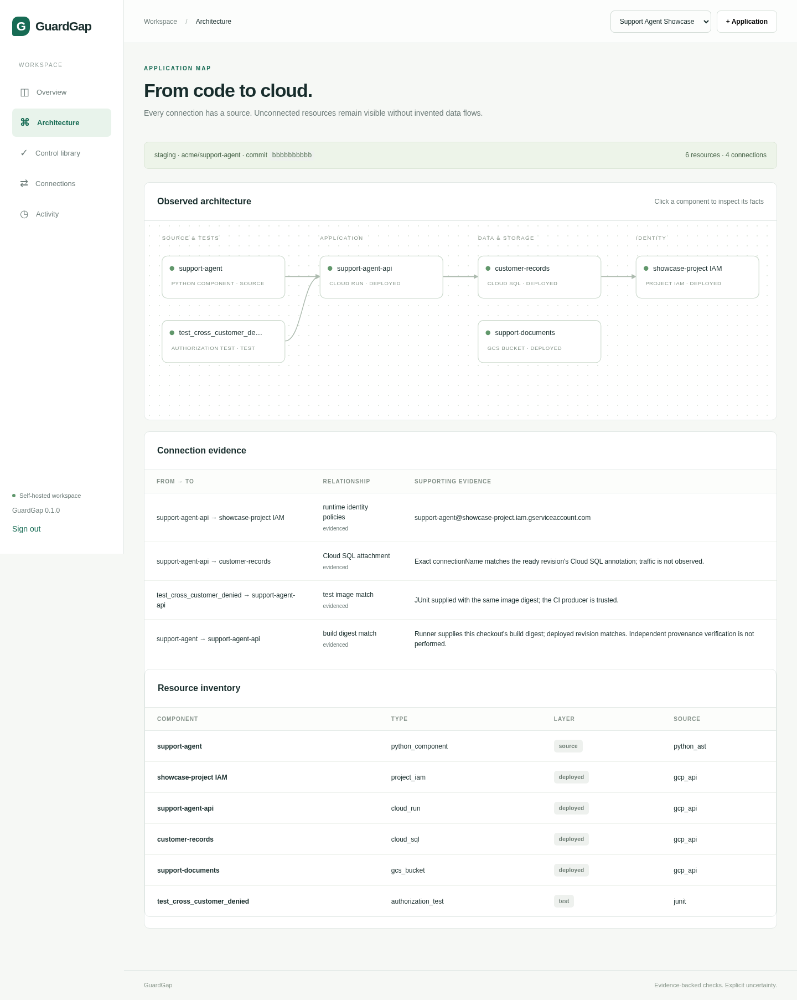
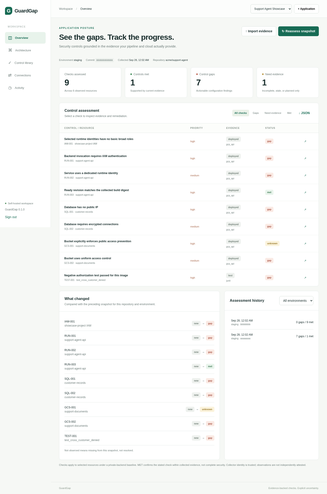
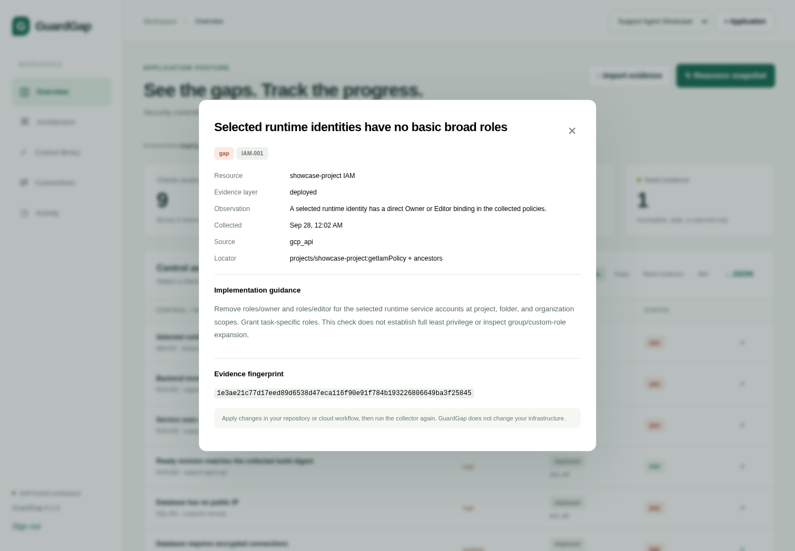
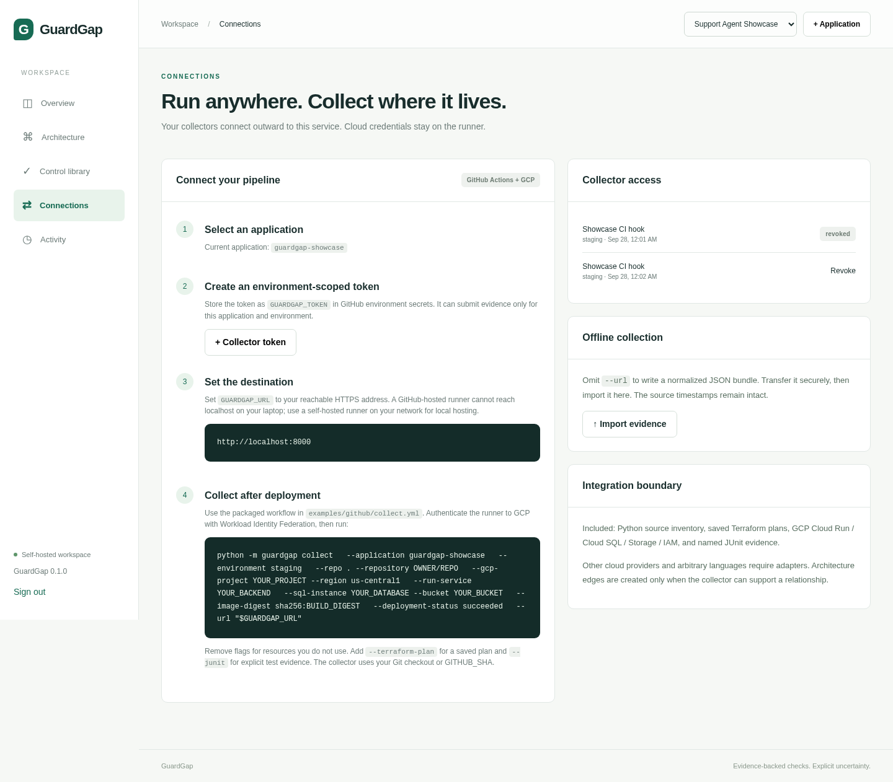
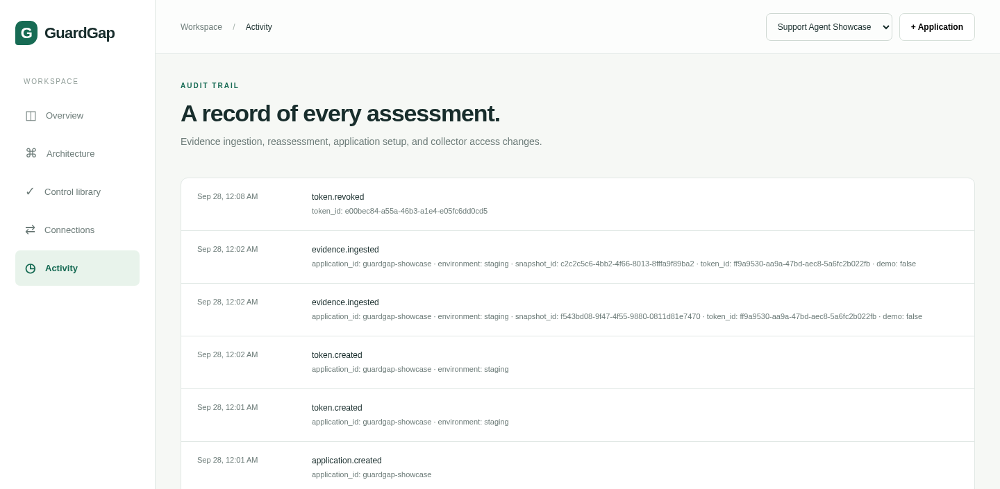

# GuardGap end-to-end showcase

**Run date:** September 28, 2026<br>
**Application:** Support Agent Showcase (`guardgap-showcase`)<br>
**Environment:** `staging`<br>
**Repository identity:** `acme/support-agent`

## Executive result

GuardGap successfully processed two complete synthetic deployment snapshots through the same collector, scoped-token API, database, assessment engine, and dashboard used for a real integration.

| Snapshot | Met | Gaps | Unknown | Outcome |
| --- | ---: | ---: | ---: | --- |
| Before remediation | 1 | 7 | 1 | Broad IAM, public invocation, public and unencrypted SQL, object ACLs, and a failed cross-customer authorization test were detected. |
| After remediation | 9 | 0 | 0 | All nine supported controls were backed by current matching evidence. |

The second assessment recorded eight transitions: seven `gap → met` changes and one `unknown → met` change. The immutable build check remained met in both snapshots.


## What was exercised

The showcase uses the runnable support-agent fixture in `examples/support-agent` and the packaged GitHub Actions collector hook in `examples/github/collect.yml`. No real cloud account was changed. The GCP API responses are synthetic, while source scanning, JUnit parsing, token authentication, HTTP ingestion, persistence, comparison, rendering, and audit logging are executed by the live GuardGap service.

1. A `guardgap-showcase` workspace was created through the authenticated application API.
2. An environment-scoped `staging` collector token was created through the token API.
3. The collector scanned the real Python fixture without executing its source.
4. It normalized synthetic Cloud Run, Cloud SQL, Cloud Storage, and project IAM observations.
5. It parsed the named `test_cross_customer_denied` JUnit result and tied it to the same image digest as the ready Cloud Run revision.
6. It submitted the bundle to `POST /api/ingest` with the scoped bearer token.
7. GuardGap persisted the immutable snapshot, ran nine deterministic checks, and created the first report.
8. A second build/deployment snapshot was submitted after the dummy remediations. GuardGap compared it with the first compatible snapshot and recorded the status transitions.

```text
GitHub Actions / trusted runner
  ├── Python AST inventory ───────────────┐
  ├── GCP read-only observations ─────────┤
  ├── build + deployed image digest ──────┼──> normalized evidence bundle
  └── named JUnit authorization result ───┘          │
                                                      │ scoped token
                                                      v
GuardGap ingest API -> immutable snapshot -> control engine -> report history -> dashboard
```

## Observed architecture

The final bundle contains six resources and four evidence-backed connections:

| From | To | Relationship | Evidence basis |
| --- | --- | --- | --- |
| `support-agent` source | `support-agent-api` | Build digest match | Collector-supplied build digest matches the ready revision digest. |
| `test_cross_customer_denied` | `support-agent-api` | Test image match | JUnit test digest matches the ready deployed image. |
| `support-agent-api` | `customer-records` | Cloud SQL attachment | Exact Cloud SQL connection name matches the ready revision annotation. |
| `support-agent-api` | `showcase-project IAM` | Runtime identity policies | Ready revision service account is correlated with collected IAM policies. |

The Storage bucket remains visible in inventory without an invented application data-flow edge. This is intentional: GuardGap only draws relationships supported by collected configuration.



## Before remediation

The first deployment deliberately contained:

- A default runtime identity with a direct Editor grant.
- Disabled Cloud Run Invoker IAM and a public invoker binding.
- A matching immutable deployed image, which correctly remained met.
- A public Cloud SQL address that allowed unencrypted connections.
- Inherited rather than explicit Storage public-access prevention.
- Object ACL support through disabled uniform bucket-level access.
- A failed cross-customer negative authorization test.



Each finding exposes the normalized observation, evidence source, locator, timestamp, fingerprint, and concrete implementation guidance.



## After remediation

The second snapshot represented these deployed changes:

| Control | Before | After | Evidence change |
| --- | --- | --- | --- |
| IAM-001 | Gap | Met | Runtime account no longer has direct Owner or Editor bindings. |
| RUN-001 | Gap | Met | Invoker IAM is enabled and no public invoker binding is present. |
| RUN-002 | Gap | Met | Ready revision uses a dedicated service account. |
| RUN-003 | Met | Met | Ready revision still matches the collector-supplied immutable build digest. |
| SQL-001 | Gap | Met | Public IPv4 is disabled and no public address is present. |
| SQL-002 | Gap | Met | SSL mode is `ENCRYPTED_ONLY`. |
| GCS-001 | Unknown | Met | Public access prevention is explicitly `enforced`. |
| GCS-002 | Gap | Met | Uniform bucket-level access is enabled. |
| TEST-001 | Gap | Met | The named cross-customer denial test passes against the deployed image digest. |

The dashboard displays both reports in history and shows each transition in the “What changed” panel.

## Collector hook and token lifecycle

The Connections view produces the command for the selected application and documents the GitHub Actions + GCP integration boundary. Collector credentials are scoped to one application and environment. The unused setup token from this run was revoked; one active showcase token remains, demonstrating that revocation is retained independently of assessment history.



The production-ready hook template is [examples/github/collect.yml](../examples/github/collect.yml). It authenticates to GCP through Workload Identity Federation, runs the collector after deployment, generates a Markdown assessment, and uploads the normalized evidence as a workflow artifact.

## Audit evidence

The live audit trail records application creation, token creation and revocation, and both evidence-ingestion events. Snapshot and token identifiers are recorded without exposing the bearer-token value.



## Evidence package

| Artifact | Purpose |
| --- | --- |
| [evidence-before.json](evidence-before.json) | Normalized collector bundle submitted for the vulnerable deployment. |
| [evidence-after.json](evidence-after.json) | Normalized collector bundle submitted for the remediated deployment. |
| [gcp-before.json](gcp-before.json) / [gcp-after.json](gcp-after.json) | Synthetic read-only GCP API observations consumed by the real normalizer. |
| [authorization-before.xml](authorization-before.xml) / [authorization-after.xml](authorization-after.xml) | Failed and passing named JUnit authorization evidence. |
| [assessment-before.md](assessment-before.md) / [assessment-after.md](assessment-after.md) | Standalone CLI reports generated from each evidence bundle. |
| [showcase-summary.json](showcase-summary.json) | Report IDs, snapshot IDs, counts, transitions, and architecture totals. |
| [SHA256SUMS.txt](SHA256SUMS.txt) | SHA-256 fingerprints for the source evidence artifacts. |

## Validation

- Production image build: passed on Python 3.12.
- Container health check: healthy; `/healthz` returned GuardGap `0.1.0`.
- Automated suite: **16 passed**.
- CLI-to-live-service test: passed, including application/token creation, two collector uploads, report history, and `7 gaps / 1 met / 1 unknown → 9 met` transition.
- Live showcase ingestion: passed with two persisted snapshots, two reports, six resources, four architecture connections, and eight recorded status transitions.
- Authenticated screenshot capture: passed against the running service at `http://localhost:8000`.

## Scope statement

This package demonstrates GuardGap’s software flow and supported control logic. The GCP observations are intentionally synthetic and do not prove that a real GCP project has these settings. A production showcase should run the same packaged collector with a read-only GCP identity after an actual deployment. A `MET` result confirms only the named predicate within collected evidence; it is not a complete security certification.
